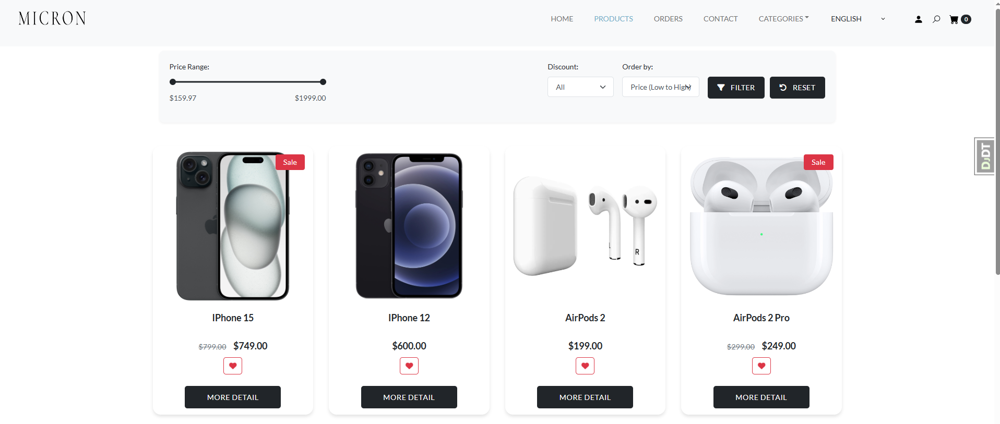
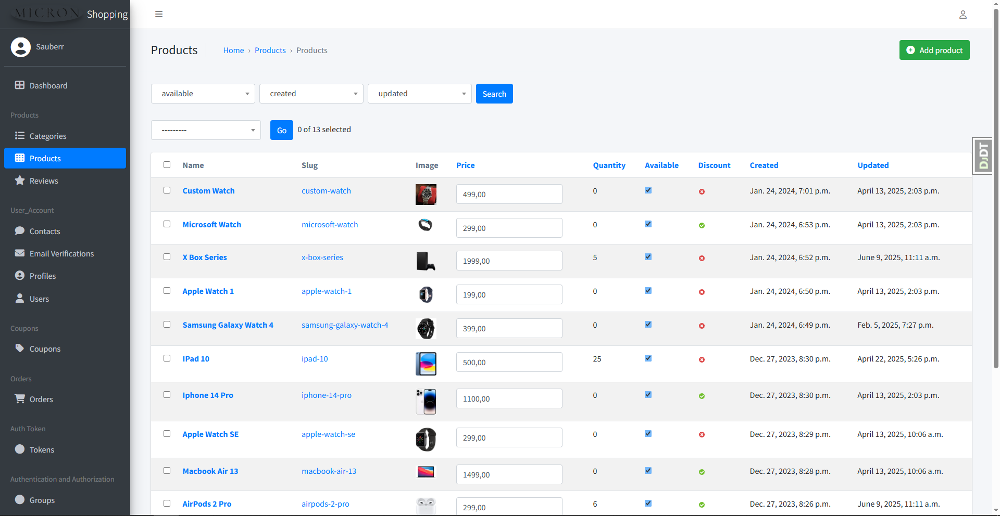

<p align="center">
  
</p>
<h1 align="center"> 🖥️ Micron Hardware Store 🖥️ </h1>

<p align="center">
  
  
  </br>
  
  
  </br>
  
  
  </br>
</p>

<h1 align="left"> 📋 About</h1> 

</br>

Micron is a cutting-edge online store specializing in computer hardware, built with Django 4.2 and Python. It's designed to provide a seamless and efficient shopping experience for tech enthusiasts. This project leverages a powerful backend stack, including PostgreSQL, Celery, Redis, RabbitMQ, and Docker, to ensure optimal performance, scalability, and reliability.

With Micron, customers can explore a vast selection of computer hardware products and easily find what they need using user-friendly filtering options and a robust search functionality. The store also offers intelligent product recommendations, ensuring customers discover items perfectly tailored to their interests. Enjoy a smooth and enjoyable shopping journey with features like convenient shopping cart management, coupon utilization for discounts, and secure order tracking.

Micron is not just about the frontend experience; it also boasts a powerful admin panel that allows for efficient management of products through CRUD operations. Furthermore, a comprehensive API built with Django REST Framework (DRF) provides seamless integration with other services, featuring search and pagination for enhanced flexibility.

This project exemplifies modern e-commerce development practices, offering a dynamic and feature-rich online store for buying and selling computer hardware. Micron supports both English and Ukrainian languages, catering to a wider audience and providing a personalized experience.

## Stack:

 - **Backend**: [**`Python 3.11+`**](https://python.org/)
 - **Frontent**: HTML, CSS, JavaScript
 - **Framework**: [**`Django 4.2+`**](https://djangoproject.com/)
 - **Database**: [**`PostgreSQL`**](https://postgresql.org/)
 - **Cache**: [**`Redis`**](https://redis.io/)
 - **Task Queue**: [**`Celery`**](https://docs.celeryq.dev/en/stable/)
 - **Message Broker**: [**`RabbitMQ`**](https://rabbitmq.com/)
 - **API**: [**`Django REST Framework`**](https://django-rest-framework.org/)
 - **Deployment**: [**`Docker`**](https://docker.com/)

<div align="center">


  






 

</div>

## 🚀 Features

* Comprehensive product catalog with advanced search functionality
* User registration and authentication system
* Social media login (Google, GitHub) integration
* Password recovery and reset functionality
* Email verification for account security
* Advanced product filtering by price, tags, and categories
* Product pagination for easy browsing
* Shopping cart management with quantity adjustments
* Coupon system for discounts and promotions
* Bonus points system for loyal customers
* Secure checkout and payment processing via Stripe
* Order tracking and order history
* User profile management with password change
* Product comments and rating system
* Product tags for better categorization
* Multi-language support (English/Ukrainian)
* Responsive design for all devices
* Powerful Django admin panel for complete store management
* CRUD operations for products, categories, and orders
* User management and customer support tools
* Sales analytics and detailed reporting
* Inventory tracking and stock management
* Coupon and promotion management system
* Bonus points system administration
* Email notification management
* Product tags and comments moderation
* Comprehensive REST API for third-party integrations
* Multi-language content management

## 🛠️ Local Development

1. **Clone the repository:**
   ```bash
   git clone https://github.com/Sauberr/techol-micron-shop.git
   cd micron-hardware-store
   ```

2. **Create and activate virtual environment:**
   ```bash
   python3.11 -m venv ../venv
   source ../venv/bin/activate  # On Windows: ..\venv\Scripts\activate
   ```
   
3. **Install dependencies:**
   ```bash
   pip install --upgrade pip
   pip install -r requirements.txt
   ```

4. **Configure environment variables:**
   ```bash
   cp .env.example .env
   ```
   
   Open `.env` file and fill in all required environment variables:
   
   ```env
   # Django Configuration
   DEBUG=True
   SECRET_KEY=django-insecure-your-secret-key-here
   DOMAIN_NAME=http://localhost:8000/
   
   # Database Configuration (PostgreSQL)
   DATABASE_NAME=micron
   DATABASE_USER=postgres
   DATABASE_PASSWORD=postgres
   DATABASE_HOST=localhost
   DATABASE_PORT=5432
   
   # Redis Configuration
   REDIS_HOST=localhost
   REDIS_PORT=6379
   REDIS_DB=1
   
   # Email Configuration
   EMAIL_BACKEND=django.core.mail.backends.smtp.EmailBackend
   EMAIL_HOST=smtp.gmail.com
   EMAIL_PORT=587
   EMAIL_USE_TLS=True
   EMAIL_HOST_USER=your_email@gmail.com
   EMAIL_HOST_PASSWORD=your_app_password_here
   
   # Other required variables...
   ```

5. **Set up database:**
   ```bash
   # Create PostgreSQL database (make sure PostgreSQL is installed and running)
   createdb micron_db
   
   # Run migrations
   python manage.py migrate
   
   # Load fixture data (optional)
   python manage.py loaddata fixtures/initial_data.json
   ```

6. **Create Django superuser:**
   ```bash
   python manage.py createsuperuser
   ```

7. **Start Redis server:**
   ```bash
   # Using Docker
   docker run -it --rm --name redis -p 6379:6379 redis
   
   # Or install Redis locally and run
   redis-server
   ```

8. **Start RabbitMQ server:**
   ```bash
   # Using Docker
   docker run -it --name rabbitmq -p 5672:5672 -p 15672:15672 rabbitmq:management
   
   # Or install RabbitMQ locally and run
   rabbitmq-server
   ```

9. **Start Celery worker (in a separate terminal):**
   ```bash
   # Activate virtual environment first
   source ../venv/bin/activate
   
   # Start Celery worker
   celery -A micron worker -l INFO --pool=solo
   ```

10. **Start Stripe webhook listener (for payment testing):**
    ```bash
    # Install Stripe CLI first: https://stripe.com/docs/stripe-cli
    stripe listen --forward-to localhost:8000/payment/webhook/
    ```

11. **Run the Django development server:**
    ```bash
    python manage.py runserver
    ```

12. **Access the application:**
    - **Main site**: http://localhost:8000
    - **Admin panel**: http://localhost:8000/admin
    - **API documentation**: http://localhost:8000/api/docs/

## 🐳 Docker Deployment

### Quick Start
```bash
# Build and start all services
docker-compose up -d --build

# View logs
docker-compose logs -f

# Stop all services
docker-compose down
```

### Create superuser via Docker
```bash
docker-compose exec web python manage.py createsuperuser
```

### Load fixture data via Docker
```bash
docker-compose exec web python manage.py loaddata fixtures/initial_data.json
```

## 🌐 API Endpoints

The application provides a comprehensive REST API:

- **Products**: `/api/products/` - List and search products
- **Categories**: `/api/categories/` - Product categories
- **Users**: `/api/users/` - User authentication and profiles

Full API documentation is available at `/api/docs/` when running the development server.

## 📞 Contact 
To contact the author of the project, write to email dmitriybirilko@gmail.com

